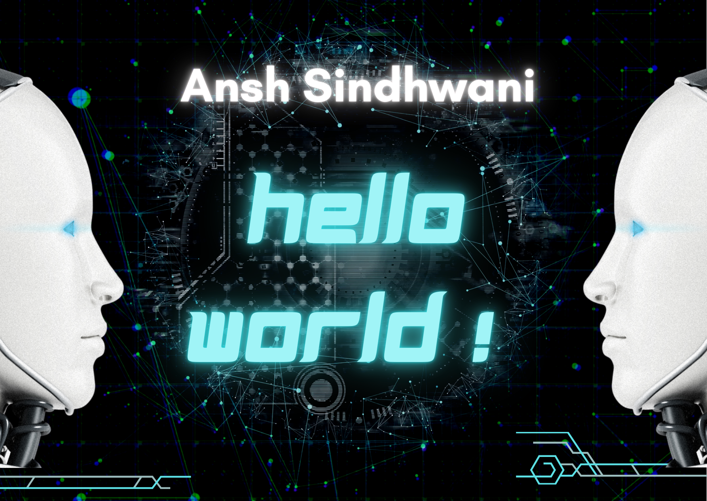

 

 

### 
Hi there, I'm Aditya 👋
  
  

- 🎓 Currently a sophomore at IIIT Hyderabad  
  

- 🌱 Passionate about data science and problem solving 
  

- 📫 How to reach me: aadityamalhotra1512@gmail.com  
  

   

## My Skill Set  

 
  
  
  
  
  
  
   
 
  
  

  

   

## Github Stats  

    
    

    
    
  

  
    

## Connect with me  

  

  

 

----
